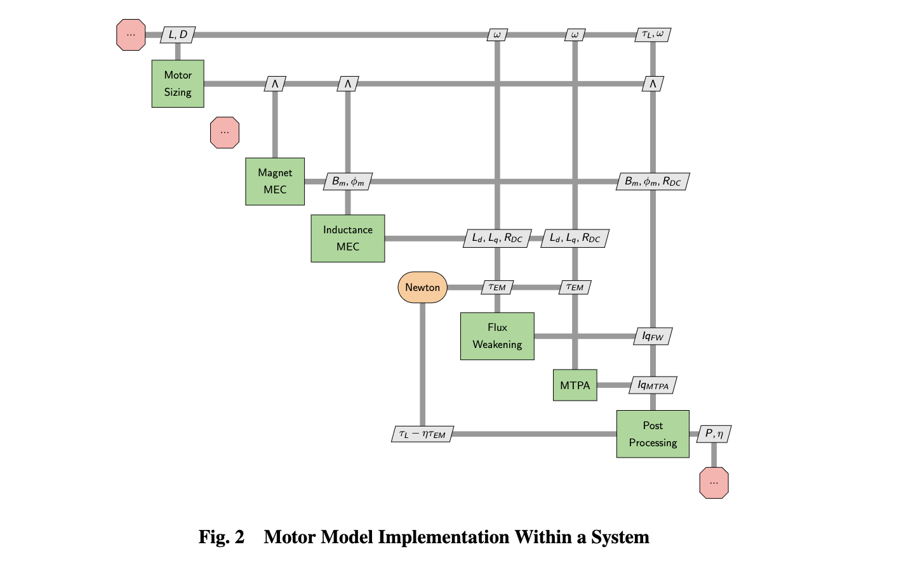

The motor model has two main subdivisions: a *sizing* as well as an *analysis* model that can be integrated into larger systems. Note that these models are valid for Permanent Magnet Synchronous Motors(PMSM) and do not directly scale/apply to other motor geometries. 

### Sizing Model 
The sizing model is relatively straightforward and the details are the model are not relevant to the user. The model
was developed so that, with an input motor length 𝐿 and motor diameter 𝐷, the rest of the motor geometry can be
determined. The sizing model uses a set of analytical relationships to output the resultant motor geometry. A large
subset of these values is used in the motor analysis model, and these are all stored in one CSDL variable. Motor mass
and resistance are the other two outputs; please note that the diagrams are incorrect because the resistance was not set as
an output to the motor sizing block.


### Analysis Model
The analysis model is a much more comprehensive and complex approach. In addition to the motor geometric
parameters and resistance, the motor analysis requires a rotational speed and torque from the upstream models and/or
optimizer. The relevant outputs for the motor analysis block are the motor power and efficiency. The model can be
broken up into three main stages: magnet operation, inductance calculation, and control methods. The magnet operation
step refers to the Magnet MEC solver, which is an implicit method that calculates the operating flux from the magnet.
Similarly, the Inductance MEC solver is an implicit method that computes the inductance components of the motor. The
third step is related to the smooth control methods to determine the operating state of the motor. This consists of a
Newton solver that wraps around two separate bracketed search solvers. The complexity behind the implementation
is dictated heavily by these bracketed searches, in which additional models are needed to look for limits and torque
and current that can guarantee a solution within a specific operation region. These bracketed searches have not been
included in the workflow diagrams because they do not contribute to the actual model evaluation.


### General Workflow
Using a Newton Solver for the control methods, the model will be integrated with **CADDEE** which will handle aircraft mass properties at an earlier stage of the optimization pipeline. 




## Bibliography

```{bibliography} references.bib
```